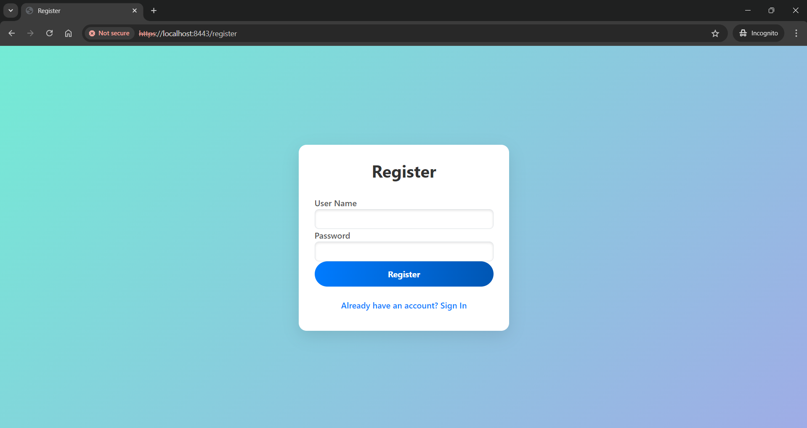
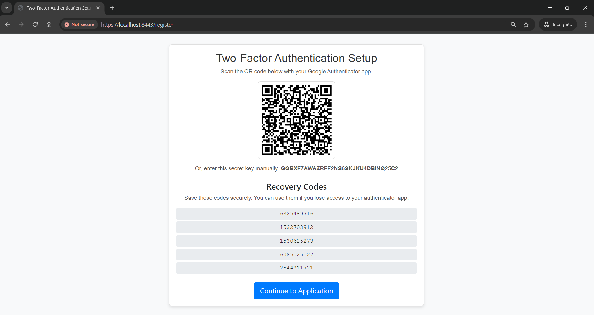
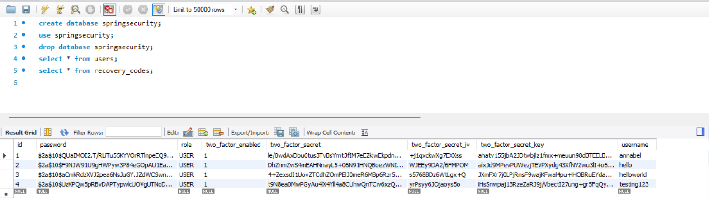

# 🛡️ **Spring Security with Two-Factor Authentication (2FA)**

## 📋 Project Overview

This project demonstrates the integration of **Spring Security** with **Two-Factor Authentication (2FA)** using Google Authenticator and recovery codes, implemented using the **Model-View-Controller (MVC)** design pattern. It provides an additional layer of security by requiring users to authenticate with something they know (their password) and something they have (an authentication code generated by the Google Authenticator app). This dual-factor approach significantly enhances security, ensuring that even if one factor is compromised, unauthorized access is still prevented.

## 🔒 Security Details

- **Two-Factor Authentication**: Implemented using the Google Authenticator app, which generates time-based one-time passwords (TOTP) preventing replay attacks.
- **Recovery Codes**: If a user loses access to their authenticator app, they can use one of the five pre-generated recovery codes. Each code is single-use; once a recovery code is used, it is automatically deleted from the system to prevent reuse.
- **Password Encryption**: User passwords are securely stored using BCrypt hashing.
- **Encryption for 2FA Secrets**: The secret keys used for 2FA are encrypted using AES (Advanced Encryption Standard) with a secure encryption configuration before being stored in the database. This ensures that the sensitive 2FA secret keys are protected at rest.
- **HTTPS**: The application uses HTTPS with a self-signed certificate to encrypt the communication between the client and server, ensuring the security and privacy of data in transit.

## ✨ Features

- **User Registration and Login**: Basic user registration and login functionality.
- **Two-Factor Authentication (2FA)**: Google Authenticator-based 2FA for enhanced security.
- **Recovery Codes**: Option to use recovery codes if access to the authenticator app is lost.
- **Encryption**: Secure storage of sensitive data using encryption.

## 💻 Technologies Used

- **Spring Boot**: Framework to create stand-alone, production-grade Spring-based Applications.
- **Spring Security**: Provides authentication and access-control framework.
- **Thymeleaf**: Template engine for rendering dynamic web content.
- **Google Authenticator**: Used for generating time-based one-time passwords (TOTP).
- **BCrypt**: Password encoding to securely store user passwords.
- **MySQL**: Database used to persist user data and recovery codes.

## 🛠️ Setup and Installation

### Prerequisites
- Java 17 or higher
- Maven 4.0+
- MySQL Database (or any other relational database)

### Clone the Repository
git clone https://github.com/jonathanlimjingchuan/springsecurity2fa-main.git
cd springsecurity2fa-main

### Configure the Database
1. Create a MySQL database.

2. Update the `application.properties` file in the `src/main/resources` directory with your database details:

    - spring.datasource.url=jdbc:mysql://your_host:your_port/your_database_name?ssl-mode=REQUIRED
    - spring.datasource.username=your_username
    - spring.datasource.password=your_password
    - spring.jpa.hibernate.ddl-auto=update

### Enabling HTTPS with a Self-Signed Certificate

To enable HTTPS with a self-signed certificate in your Spring Boot application, follow these steps:

1. Generate a Self-Signed Certificate

- You can generate a self-signed certificate using the Java `keytool` command. Open your terminal or command prompt and execute the following command:

```bash
keytool -genkeypair -alias myalias -keyalg RSA -keysize 2048 -storetype PKCS12 -keystore keystore.p12 -validity 3650

- application.properties:

  - server.port=8443
  - server.ssl.key-store=classpath:keystore.p12
  - server.ssl.key-store-password=yourpassword
  - server.ssl.key-store-type=PKCS12
  - server.ssl.key-alias=localcert

- Information:

-alias myalias: The alias for the certificate.
-keyalg RSA: The algorithm to generate the key pair (RSA).
-keysize 2048: The size of the key (2048 bits).
-storetype PKCS12: The type of keystore (PKCS12 is recommended).
-keystore keystore.p12: The name of the keystore file that will be generated.
-validity 3650: The number of days the certificate is valid (10 years in this example).
You will be prompted to enter a password and some details for the certificate, such as your name, organization, etc.

```

### Build and Run the Application

**Build the project:**

mvn clean install

**Run the application:**

mvn spring-boot:run

Access the application at `https://localhost:8443`.

## 📂 Project Structure

```plaintext
springsecurity2fa/
│
├── src/
│   ├── main/
│   │   ├── java/springsecurity/mfa/
│   │   │   ├── config/           # Security and Encryption configurations
│   │   │   ├── controller/       # Controllers handling web requests
│   │   │   ├── model/            # Entity classes for User, RecoveryCode, etc.
│   │   │   ├── repository/       # Repository interfaces for database access
│   │   │   └── service/          # Services containing business logic
│   │   └── resources/
│   │       ├── templates/        # Thymeleaf templates for UI rendering
│   │       └── application.properties  # Configuration properties
│   └── test/                     # Unit and integration tests
│
├── pom.xml                       # Maven POM file for dependencies
└── README.md                     # Project documentation
```

## 🎨 Screenshots

### 🖥️ Welcome, Login, & Register Page
1. **Welcome Page:**
   <div align="center">
     
   </div>

2. **Login Page:**
   <div align="center">
     
   </div>

3. **Login Page with Error:**
   <div align="center">
     
   </div>

4. **Register Page:**
   <div align="center">
     
   </div>

5. **Registration:**
   <div align="center">
     
   </div>

### 🖥️ 2FA Setup Page
1. **2FA Setup Page with QR & Recovery Code Details:**
   <div align="center">
     
   </div>

2. **2FA Verification via TOTP:**
   <div align="center">
     
   </div>

3. **Verification Succeeded:**
   <div align="center">
     
   </div>

### 🖥️ Recovery Code Page

1. **Recovery Code Page:**
   <div align="center">
     
   </div>

3. **2FA Verification via Recovery Code:**
   <div align="center">
     
   </div>

4. **Database Information:**
   <div align="center">
     
   </div>

5. **Deletion of Recovery Code, user_id 4 (Before):**
   <div align="center">
     
   </div>

6. **Deleted of Recovery Code, user_id 4 (After):**
   <div align="center">
     
   </div>

7. **Recovery Code Page with Success:**
   <div align="center">
     
   </div>

## 📚 References

This project was built with the help of various resources that provided valuable insights and guidance. 

- [Google Authenticator Library](https://central.sonatype.com/artifact/com.warrenstrange/googleauth) - For providing the essential library used to implement TOTP-based two-factor authentication.
- [Implementing TOTP-based Two-Factor Authentication in Spring Boot](https://medium.com/codex/implementing-totp-based-two-factor-authentication-in-spring-boot-f4c2a6a26f16) - A detailed guide that was instrumental in setting up 2FA in a Spring Boot application.
- [Spring Security Two-Factor Authentication](https://www.geeksforgeeks.org/spring-security-two-factor-authentication/) - An in-depth article that offered a comprehensive understanding of adding two-factor authentication to a Spring Security project.
- [Securing a Web Application](https://spring.io/guides/gs/securing-web) - Official Spring guide that provided foundational knowledge for implementing security in this application.
